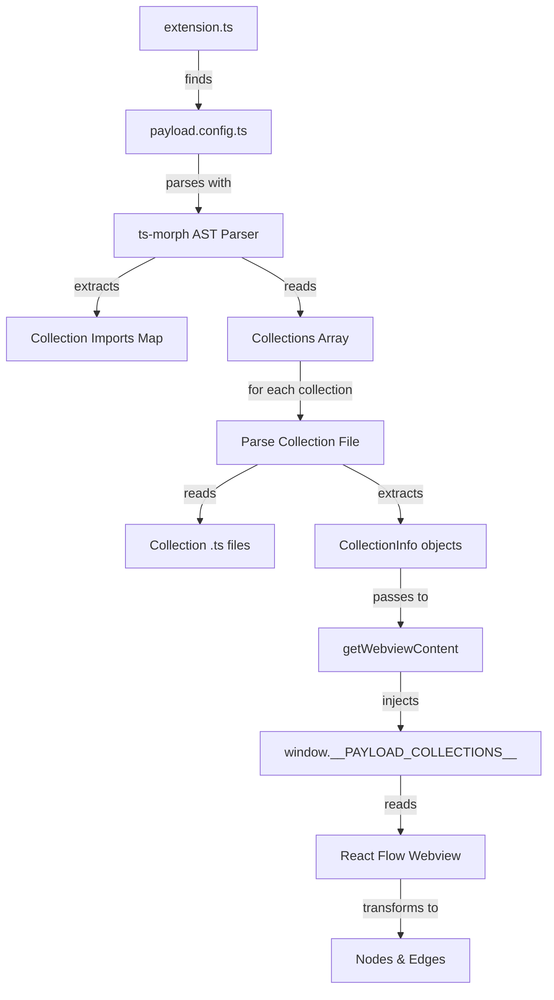

# Payload CMS Config Parser Implementation Plan

## Objective
Parse Payload CMS `payload.config.ts` and collection files to extract collection configurations and relationships, then pass the data to the React Flow webview for visualization.

## Architecture Overview



## Implementation Steps

### Step 1: Install ts-morph Dependency
- Add `ts-morph` to root `package.json` dependencies
- Run `pnpm install`

### Step 2: Create TypeScript Interfaces
**File:** `src/types/payload.ts`
```typescript
export interface CollectionInfo {
  name: string;
  slug: string;
  label?: string;
  fields: FieldInfo[];
  relationships: RelationshipInfo[];
}

export interface FieldInfo {
  name: string;
  type: string;
  relationTo?: string;
  hasMany?: boolean;
}

export interface RelationshipInfo {
  fromCollection: string;
  fromField: string;
  toCollection: string;
  relationType: "hasOne" | "hasMany" | "belongsTo" | "belongsToMany";
}
```

### Step 3: Create Config Parser Utility
**File:** `src/utils/payload-config-parser.ts`

- Implement `parsePayloadConfig(configPath: string)` function
- Parse `buildConfig()` call to extract collections array
- Build import-to-path mapping from import statements
- For each collection identifier in collections array:
  - Find corresponding import path
  - Resolve `@/` alias to actual file path
  - Parse collection file to extract slug, label, fields
  - Identify relationship fields (`type: "relationship"`)
  - Return `CollectionInfo[]`

### Step 4: Update extension.ts
**File:** `src/extension.ts`

- Import `parsePayloadConfig` from utils
- Import `CollectionInfo` type
- In command handler:
  - Use `vscode.workspace.findFiles("**/payload.config.ts")` to locate config
  - Call `parsePayloadConfig(configPath)` to get collections
  - Pass collections array to `getWebviewContent(context, webview, collections)`

### Step 5: Update getWebviewContent.ts
**File:** `src/getWebviewContent.ts`

- Update function signature to accept optional collections parameter
- Serialize collections to JSON and inject via `window.__PAYLOAD_COLLECTIONS__`
- Handle case when no collections found (use empty array)

### Step 6: Update React Webview
**File:** `webview/src/ui/payload-visualizer/widgets/PayloadVisualizerScreen.tsx`

- Access `window.__PAYLOAD_COLLECTIONS__` to get data
- Transform `CollectionInfo[]` to React Flow nodes:
  ```typescript
  const nodes = collections.map((collection, index) => ({
    id: collection.slug,
    position: { x: index * 250, y: index * 100 },
    data: { label: collection.label || collection.name },
    type: "default",
  }));
  ```
- Transform to edges for relationship fields:
  ```typescript
  const edges = collections.flatMap((collection) =>
    collection.fields
      .filter((field) => field.type === "relationship" && field.relationTo)
      .map((field) => ({
        id: `${collection.slug}-${field.name}`,
        source: collection.slug,
        target: field.relationTo!,
        label: field.name,
        type: "smoothstep",
      }))
  );
  ```

### Step 7: Handle Path Alias Resolution
- The config uses `@/` imports (e.g., `@/models/collections/Admins`)
- Need to resolve these to actual file paths
- Options:
  1. Read `tsconfig.json` to get `paths` configuration
  2. Use `path.join(configDir, "../src")` as base for `@/` resolution
  3. Pattern: `@/models/collections/Admins` → `{configDir}/../src/models/collections/Admins.ts`

### Step 8: Testing
- Test with actual Payload CMS project
- Verify all collections are detected
- Verify relationships are correctly mapped
- Handle edge cases (missing files, malformed configs)

## Files to Create/Modify

| File | Action |
|------|--------|
| `src/types/payload.ts` | Create |
| `src/utils/payload-config-parser.ts` | Create |
| `src/extension.ts` | Modify |
| `src/getWebviewContent.ts` | Modify |
| `webview/src/ui/payload-visualizer/widgets/PayloadVisualizerScreen.tsx` | Modify |

## Dependencies
- `ts-morph` - AST parsing for TypeScript files