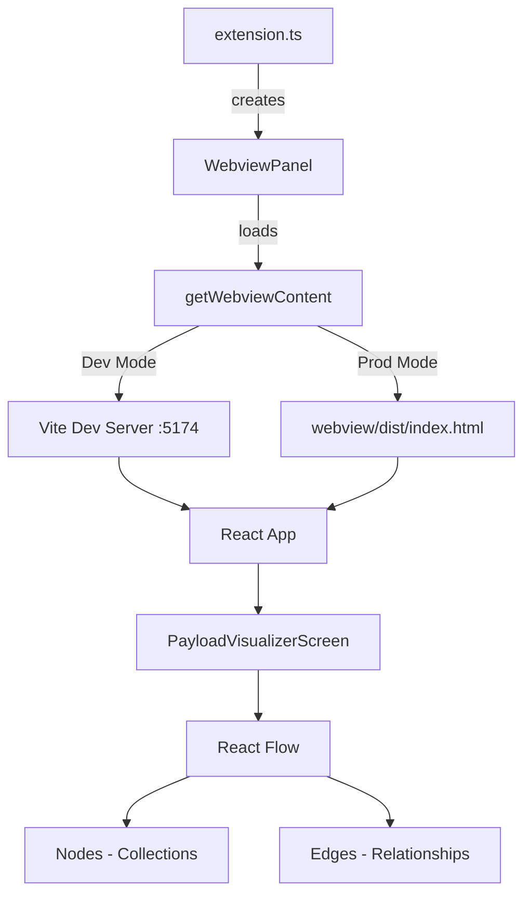

# Architecture

## System Overview

```
┌─────────────────────────────────────────────────────────────┐
│                    VS Code Extension                         │
│  ┌─────────────────────────────────────────────────────┐    │
│  │  src/extension.ts                                    │    │
│  │  - Registers command: payload-cms-booster.visualize  │    │
│  │  - Creates WebviewPanel                              │    │
│  │  - Manages extension lifecycle                       │    │
│  └─────────────────────────────────────────────────────┘    │
│  ┌─────────────────────────────────────────────────────┐    │
│  │  src/getWebviewContent.ts                            │    │
│  │  - Dual-mode content delivery                        │    │
│  │  - Dev: proxies to Vite dev server (port 5174)       │    │
│  │  - Prod: serves from webview/dist/                   │    │
│  │  - CSP generation for security                       │    │
│  └─────────────────────────────────────────────────────┘    │
└─────────────────────────────────────────────────────────────┘
                              │
                              ▼
┌─────────────────────────────────────────────────────────────┐
│                    React Webview (webview/)                  │
│  ┌─────────────────────────────────────────────────────┐    │
│  │  App.tsx → PayloadVisualizerScreen.tsx               │    │
│  │  - Main React component                              │    │
│  │  - React Flow canvas integration                     │    │
│  └─────────────────────────────────────────────────────┘    │
│  ┌─────────────────────────────────────────────────────┐    │
│  │  React Flow (@xyflow/react)                          │    │
│  │  - Nodes: Collection representations                 │    │
│  │  - Edges: Relationship connections                   │    │
│  │  - Controls, MiniMap, Background                     │    │
│  └─────────────────────────────────────────────────────┘    │
└─────────────────────────────────────────────────────────────┘
```

## Source Code Paths

| Path | Purpose |
|------|---------|
| `src/extension.ts` | Extension entry point, command registration |
| `src/getWebviewContent.ts` | Webview HTML generation, dev/prod mode handling |
| `webview/src/App.tsx` | Main React application component |
| `webview/src/ui/payload-visualizer/widgets/PayloadVisualizerScreen.tsx` | React Flow visualization component |
| `webview/vite.config.ts` | Vite bundler configuration |
| `webview/package.json` | Webview dependencies (React 19, React Flow) |

## Key Technical Decisions

1. **React Flow for Visualization**: Chosen for its robust node/edge rendering, interactive controls, and React-native experience
2. **Dual-Mode Webview**: Development uses Vite HMR (port 5174), production serves static files from `webview/dist/`
3. **CSP Security**: Content Security Policy configured for both modes with nonces
4. **TypeScript**: Full type safety across extension and webview

## Design Patterns

- **VS Code Webview API**: Uses `createWebviewPanel` for extension integration
- **React Functional Components**: Hooks-based state management (`useState`, `useCallback`)
- **Module Federation via Vite**: Dev mode uses external URI resolution for HMR

## Component Relationships



## Critical Implementation Paths

1. **Extension Activation**: `activate()` → register command → create webview
2. **Webview Content Loading**: `getWebviewContent()` → detect mode → return HTML
3. **Visualization Rendering**: React Flow initialization with nodes/edges state